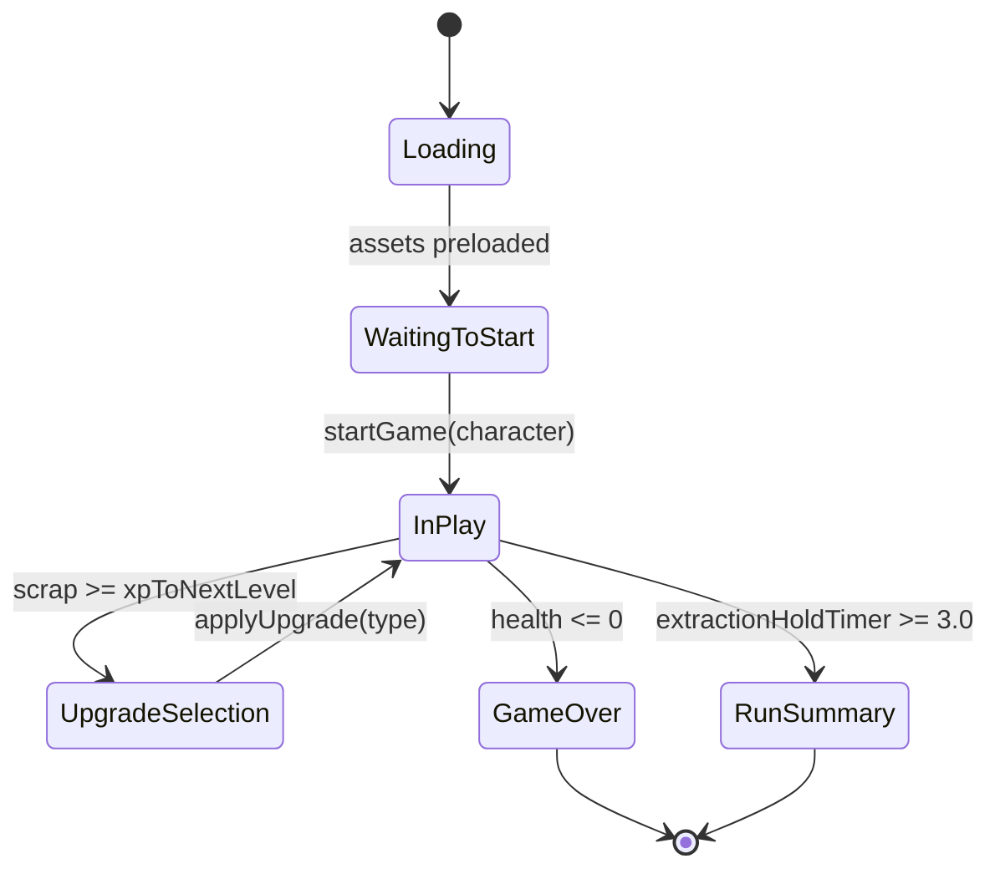
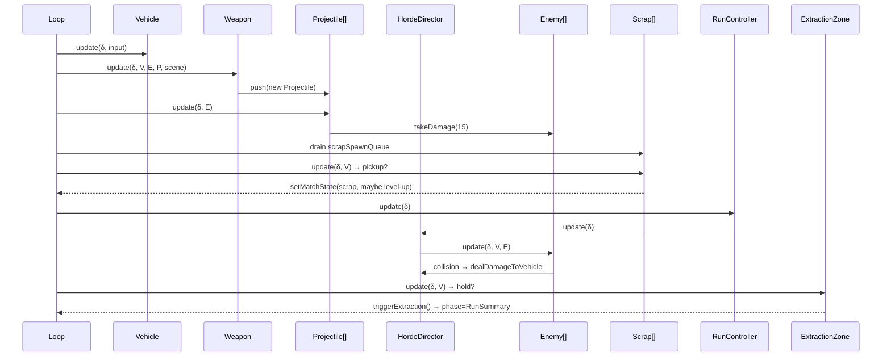
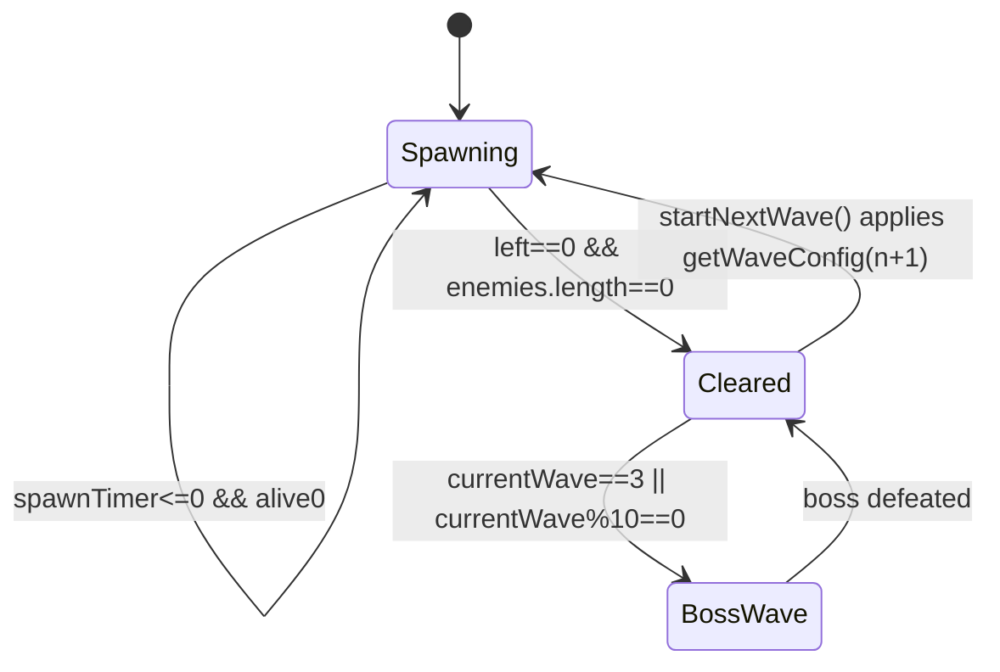

# ULTIMATE H-TOWN COMBAT MASTER MANUAL
### System Technical Reference — Penibly Accurate, Line-Cited

> **Subject**: H-TOWN COMBAT (The Autoballer) — 2v2 Vehicle Extraction Survivor
> **Scope**: Web Prototype (TS / React / Zustand / Three.js) + Legacy Unity Reference (C#)
> **Purpose**: A developer could rewrite the entire game logic from this document alone.
> **Sources**:
> - Web: `H-TOWN COMBAT-reboot-migration-web-prototype-source/src/`
> - Unity: `legacy-unity-source/Assets/Scripts/`
> - Design: `docs/GDD.md`, `docs/ROADMAP.md`

---

## TABLE OF CONTENTS

1. [Game State Machine](#1-game-state-machine)
2. [Frame-by-Frame Loop Architecture](#2-frame-by-frame-loop-architecture)
3. [Object State Enumeration](#3-object-state-enumeration)
4. [Economy & Progression (Hyper-Detailed)](#4-economy--progression)
5. [Skill Tree Matrix (Rixa / Marek)](#5-skill-tree-matrix)
6. [Unity → TypeScript Data Mapping](#6-unity--typescript-data-mapping)
7. [Numeric Constants Reference](#7-numeric-constants-reference)
8. [Gap Analysis (Web vs Unity vs GDD)](#8-gap-analysis)

---

## 1. GAME STATE MACHINE

### 1.1 Phase Enumeration (Web — `src/store.ts`)

```ts
phase: "Loading" | "WaitingToStart" | "InPlay" | "Extraction"
     | "GameOver" | "RunSummary" | "UpgradeSelection"
```

| Phase | Enters From | Exits To | Trigger | Loop Updates Active |
|-------|-------------|----------|---------|---------------------|
| `Loading` | — | `WaitingToStart` | Assets preloaded | Render only |
| `WaitingToStart` | `Loading` | `InPlay` | `startGame(character)` UI action | Render only |
| `InPlay` | `WaitingToStart`, `UpgradeSelection` | `UpgradeSelection` / `GameOver` / `RunSummary` | see below | Full simulation |
| `UpgradeSelection` | `InPlay` | `InPlay` | `applyUpgrade(type)` | Paused |
| `GameOver` | `InPlay` | — | `health <= 0` in `HordeDirector.dealDamageToVehicle` | Paused |
| `RunSummary` | `InPlay` | — | Extraction hold ≥ 3.0s in `ExtractionZone.triggerExtraction` | Paused |
| `Extraction` | *(unused in web)* | — | — | — |

### 1.2 Mermaid — Web Phase Diagram



### 1.3 Unity Run-Outcome Enum (`Assets/Scripts/Systems/Save/SaveData.cs:75–81`)

```csharp
public enum RunOutcome { Unknown, Extracted, Died, Survivor }
```

| Outcome | Banks Resources? | Triggered By |
|---------|------------------|--------------|
| `Extracted` | **YES** (after optional penalty) | `ExtractionZone.Update()` hold ≥ `extractionHoldSeconds` |
| `Survivor` | **YES** (full) | `ArenaRunController.HandleWaveTimedOut` |
| `Died` | **NO** | Player health ≤ 0 |
| `Unknown` | — | Default |

---

## 2. FRAME-BY-FRAME LOOP ARCHITECTURE

### 2.1 Master Tick (`src/game/Game.ts:117–184`)

```ts
const delta     = Math.min(this.clock.getDelta(), 0.05)  // hard cap 50 ms
const timeScale = 1.0
const scaledDelta = delta * timeScale
const state = useGameStore.getState()
```

**Delta Handling**
- Single variable-step integration. No fixed-step.
- Cap at `0.05s` to prevent "spiral of death" on tab resume.
- `timeScale` is a global multiplier (reserved for slow-mo / pause).

### 2.2 Update Order — only when `phase === "InPlay"`

| # | System | Call Site | δ Scaled? | Effect |
|---|--------|-----------|-----------|--------|
| 1 | **Input sampling** | keyboard events | — | Populate key state |
| 2 | **Vehicle** | `vehicle.update(scaledDelta, input)` | yes | Accel / brake / steer / arena clamp |
| 3 | **Weapon** | `weapon.update(scaledDelta, vehicle, enemies, projectiles, scene)` | yes | Auto-target nearest enemy < 15u; spawn Projectile |
| 4 | **Projectiles** | `p.update(scaledDelta, enemies)` ∀ | yes | Move; 2D collision vs enemies; apply damage |
| 5 | **Scrap Spawn Queue drain** | `HordeDirector.scrapSpawnQueue.shift()` | — | Instantiate `Scrap` at queued positions |
| 6 | **Scrap pickups** | `s.update(scaledDelta, vehicle)` ∀ | yes | Bobbing + radius 2.5 pickup; XP / level-up |
| 7 | **RunController** | `runController.update(scaledDelta)` | yes | Gate extraction; delegate to `HordeDirector` |
| 8 | **HordeDirector** | (via `runController`) `.update(delta)` | yes | Spawn timer, enemy.update, collision → damage, dead cleanup, wave progression |
| 9 | **ExtractionZone** | `extractionZone.update(scaledDelta, vehicle)` | yes | Hold timer inside 5u radius, pulsing opacity, trigger `RunSummary` |
| 10 | **Camera shake decay** | `cameraShakeIntensity -= scaledDelta * 1.5` | yes | Fade post-fire shake |

**Always-run (any phase)**
| # | System | Purpose |
|---|--------|---------|
| 11 | `updateCamera(false)` | Chase cam lerp α = 0.1 + shake offset |
| 12 | `hud.update(...)` | React store sync (no-op; handled by subscription) |
| 13 | `renderer.render(scene, camera)` | WebGL draw |
| 14 | `input.endFrame()` | Clear `justPressed` set |

### 2.3 Sequence Diagram



---

## 3. OBJECT STATE ENUMERATION

### 3.1 Vehicle (`src/game/Vehicle.ts`)

**Properties**

| Property | Type | Initial | Role |
|---|---|---|---|
| `group` | `THREE.Group` | `new THREE.Group()` | Root transform |
| `body` | `THREE.Group` | from `AssetManager.getVehicleModel()` or fallback box | Visual mesh |
| `speed` | `number` | `0` | Signed scalar velocity |
| `maxSpeed` | `number` (readonly) | `15` | Forward cap (u/s) |
| `acceleration` | `number` (readonly) | `25` | u/s² gas |
| `deceleration` | `number` (readonly) | `10` | u/s² drag |
| `brakeForce` | `number` (readonly) | `35` | u/s² active brake |
| `turnSpeed` | `number` (readonly) | `2.5` | rad/s |
| `facingAngle` | `number` (private) | `0` | yaw; 0 = +Z |

**Implicit States** (no enum; derived from scalars)

| State | Guard |
|---|---|
| `Idle` | `speed == 0 && !input.gas && !input.brake` |
| `Accelerating` | `input.gas && speed < maxSpeed` |
| `Braking` | `input.brake && speed > -maxSpeed*0.4` |
| `Coasting` | `!input.gas && !input.brake && speed != 0` (damps at `deceleration`) |
| `Reversing` | `speed < 0` (steering inverted, cap `-maxSpeed*0.4 = -6`) |

**Transitions** — all in `update()`:
```
gas     → speed += 25*δ     (clamped ≤ 15)
brake   → speed -= 35*δ     (clamped ≥ -6)
neither → speed ±= 10*δ     (toward 0)
|speed|>0.05*15 → facingAngle += turnStr * 2.5 * δ * (speed<0 ? -1 : 1)
position += facingDir * speed * δ
position.{x,z} = clamp(pos, ±38)        // PITCH.half* - 2 = 38
```

### 3.2 Enemy (`src/game/Enemy.ts`)

**Properties**

| Property | Type | Initial (Enemy / Boss) | Role |
|---|---|---|---|
| `group` | `THREE.Group` | new | Root |
| `body` | `THREE.Group` | from `AssetManager` / fallback cylinder | Visual |
| `isBoss` | `boolean` | `false` / `true` | Drop-tier flag |
| `speed` | `number` | `8 / 10` | u/s |
| `hp` | `number` | `30 / 1000` | Health |
| `damage` | `number` | `4 / 30` | Per-frame contact damage |
| `radius` | `number` | `0.6 / 1.5` | Collision |

**States**

| State | Guard | Action |
|---|---|---|
| `Seeking` | `distToTarget > 0.5` | Rotate `atan2(dir.x, dir.z)`, advance `speed*δ` |
| `Flocking` | any neighbor within `r₁+r₂+0.2` | Separation force `* 5`; push from vehicle if `<1.8` |
| `Attacking` | `dist < 1.5` (in `HordeDirector`) | `dealDamageToVehicle(damage*δ)` |
| `HitFlash` | last `takeDamage()` within 100 ms | `emissive = 0xffffff` |
| `Dead` | `hp <= 0` | Enqueue scrap drop; splice from list |

### 3.3 HordeDirector (`src/game/HordeDirector.ts`)

| Property | Type | Initial | Role |
|---|---|---|---|
| `enemies` | `Enemy[]` | `[]` | Active roster |
| `spawnTimer` | `number` | `config.spawnInterval` | Countdown |
| `currentWave` | `number` | `1` | Wave index |
| `config` | `WaveData` | `getWaveConfig(1)` | Current wave params |
| `enemiesLeftToSpawn` | `number` | `config.enemiesToSpawn` | Quota remaining |
| `scrapSpawnQueue` | `{pos, isLegendary}[]` | `[]` | Deferred drops |

**Wave FSM**



**Boss spawn guard**: `currentWave === 3 || currentWave % 10 === 0` → `spawnBoss()` at `(0,0,20)`.

### 3.4 Weapon (`src/game/Weapon.ts`)

| Property | Type | Initial | Role |
|---|---|---|---|
| `baseFireRate` | `number` | `0.35` | Seconds between shots |
| `fireTimer` | `number` | `0` | Cooldown |
| `range` | `number` | `15.0` | Auto-target radius |
| `muzzleFlashLight` | `THREE.PointLight` | `(0xffea00, 0, 10)` | Flash FX |
| `flashTimer` | `number` | `0` | Flash duration |

**States**

| State | Guard |
|---|---|
| `Cooldown` | `fireTimer > 0` |
| `Searching` | `fireTimer <= 0 && no enemy in 15u` |
| `Firing` | `fireTimer <= 0 && nearestEnemy found` |
| `Flashing` | `flashTimer > 0` (visual only) |

Effective rate = `baseFireRate / max(1.0, modifiers.fireRateMult)`.

### 3.5 Projectile (`src/game/Projectile.ts`)

| Property | Type | Initial | Role |
|---|---|---|---|
| `velocity` | `Vector3` | `direction * 45` | u/s |
| `lifeTime` | `number` | `2.0` | TTL seconds |
| `damage` | `number` | `15` (+ `modifiers.damageBonus`) | Hit damage |
| `isDead` | `boolean` | `false` | Removal flag |

**Transitions**: `lifeTime -= δ → if ≤0: dead`; on 2D distSq < `(enemy.radius+0.3)²` → `enemy.takeDamage(damage)`, `dead=true`.

### 3.6 Scrap (`src/game/Scrap.ts`)

| Field | Normal | Legendary |
|---|---|---|
| `value` | `10` | `500` |
| geometry | `Octahedron(0.3)` | `Octahedron(0.8)` |
| color / emissive | `0x00ff88 / 0x00aa44` | `0xff0000 / 0xaa0000` |
| initial y | `0.5` | `1.0` |

**Pickup**: `dist < 2.5` → `scrap += floor(value * scrapMult)`; if `scrap ≥ xpToNextLevel`: subtract threshold, `level++`, `xpToNextLevel = floor(prev * 1.5)`, `phase = "UpgradeSelection"`.

### 3.7 ExtractionZone (`src/game/ExtractionZone.ts`)

| Property | Initial |
|---|---|
| `active` | `false` |
| `holdTimer` | `0` |
| `requiredHoldTime` | `3.0` |
| `radius` | `5.0` |

**Guards**:
- `!active || phase !== "InPlay"` → skip
- `dist < 5.0` → `holdTimer += δ`; ring opacity pulses
- else → `holdTimer = 0`
- `holdTimer >= 3.0` → `triggerExtraction()` → `phase = "RunSummary"`

### 3.8 RunController (`src/game/RunController.ts`)

Trigger: `wave >= 4 && enemiesAlive === 0 && !extractionDeployed` → `extractionZone.activate((0,0,0))`; afterwards halts `HordeDirector` updates.

---

## 4. ECONOMY & PROGRESSION

### 4.1 Scrap Logic (Web)

| Parameter | Value | Source |
|---|---|---|
| Base drop (enemy) | `10` | `Scrap.ts` |
| Legendary drop (boss) | `500` | `Scrap.ts` + `HordeDirector.scrapSpawnQueue.isLegendary=true` |
| Pickup radius | `2.5 units` | `Scrap.update` |
| Scrap multiplier | `modifiers.scrapMult` (Marek +0.5 → ×1.5) | `store.ts` |
| XP threshold (init) | `50` | `store.ts` |
| XP threshold growth | `× 1.5` per level-up (floor) | `Scrap.ts` |
| Level-up frequency | Each time `scrap ≥ xpToNextLevel` | `Scrap.ts` |

**Threshold curve** (first 8 levels):

| Level | xpToNextLevel |
|---|---|
| 1→2 | 50 |
| 2→3 | 75 |
| 3→4 | 112 |
| 4→5 | 168 |
| 5→6 | 252 |
| 6→7 | 378 |
| 7→8 | 567 |
| 8→9 | 850 |

### 4.2 Tech Logic (Unity Legacy — not present in Web yet)

| Parameter | Value / Source |
|---|---|
| In-run tracking | `ResourceManager.Tech` (`Loot/ResourceManager.cs`) |
| Pickup event | `LootResourcePickup.PickedUp` with `{scrap, tech, source}` |
| Bonus Tech roll | `bonusTechChance ∈ [0,1]`, `bonusTechAmount` |
| Multiplier | `BountyRuntimeEffects.ApplyTechMultiplier(base)` |
| Persist on Extracted | **YES** (after `lootPenaltyPercent` deduction) |
| Persist on Died | **NO** (lost) |
| Persist on Survivor | **YES** (full) |
| Storage | `MetaProgress.totalTech` in `SaveData.cs` |

**Extraction loot penalty** (`ExtractionZone.cs` + `ArenaRunController.cs`):

```csharp
earlyExtractionWaveIndex = 1
earlyExtractionLootPenalty ∈ [0,1]   // e.g. 0.25 = -25 % Scrap & Tech
// On boss: SetLootPenalty(0)
```

### 4.3 GDD vs Implementation Discrepancy

| Source | Extraction hold | Penalty on wipe |
|---|---|---|
| GDD.md | **30 s** | Keep 50 % Scrap, **lose 100 % Tech** |
| Web impl | **3 s** | Scrap not deducted on death |
| Unity impl | configurable (`extractionHoldSeconds`, default 3) | Configurable 0–100 % |

### 4.4 Character Passive Modifiers (Web `store.ts:74–106`)

| Character | Effects |
|---|---|
| **Rixa** | `damageBonus += 5`; `fireRateMult += 0.15`; `maxHealth=100, health=100` |
| **Marek** | `scrapMult += 0.5`; `maxHealth=150, health=150` |

### 4.5 Run-Time Upgrades (Web — level-up offerings)

| Upgrade | Effect (`store.ts:111–129`) |
|---|---|
| `Armor` | `maxHealth += 50`; `health = min(health+50, maxHealth)` |
| `Turbo` | `speedMult += 0.1` |
| `Cannons` | `fireRateMult += 0.2`; `damageBonus += 5` |

### 4.6 Wave Scaling (`src/game/WaveConfig.ts`)

| Wave | maxAlive | enemiesToSpawn | spawnInterval | hpMod | spdMod | Notes |
|---|---|---|---|---|---|---|
| 1 | 8 | 10 | 2.0 | 1.0 | 0.6 | Intro |
| 2 | 15 | 25 | 1.5 | 1.1 | 0.8 | — |
| 3 | 25 | 50 | 1.0 | 1.4 | 1.0 | **Boss** |
| 4 | 30 | 80 | 0.8 | 1.8 | 1.2 | Extraction arms |
| ≥5 | `30+5(n−4)` | `80+20(n−4)` | `max(0.2, 0.8−0.1(n−4))` | `1.8+0.5(n−4)` | `1.2+0.1(n−4)` | Endless |

---

## 5. SKILL TREE MATRIX

### 5.1 Unity Schema (`Assets/Scripts/Systems/Hub/HubData.cs`)

```csharp
CharacterData
├── baseStats: CharacterBaseStats { maxHealth, armor, moveSpeedPercent, critChancePercent, pickupRadiusPercent }
├── passiveTrait: CharacterTrait  { name, description, durationSeconds, damagePercentPerStack, maxStacks }
├── passiveSkills[]: CharacterPassiveSkill { name, description, valuePerLevel, isPercent, hardcapValue }
├── passiveProgressionRules: CharacterPassiveProgressionRules
│   ├── levelsPerCostStep
│   ├── costStep1 / costStep2 / costStep3          // Tech cost per rank (step function)
│   ├── fullValueLevels / halfValueLevels
│   ├── halfValueMultiplier (0.5)
│   ├── quarterValueMultiplier (0.25)
│   └── additiveHardcapPercent / chanceHardcapPercent
├── activeAbility: CharacterActiveAbility          // usesPerRun, hits, damagePerHit, stunSeconds
├── skillTree: CharacterSkillTree
│   ├── rules: CharacterSkillTreeRules
│   │   ├── tier1/2/3/capstoneUnlockTotal          // total rank required to unlock tier
│   │   ├── tier1/2/3/capstoneCost                 // points per node
│   │   ├── postCapstoneMaxRanks
│   │   ├── postCapstoneEarlyRankBonusPercent
│   │   ├── postCapstoneLateRankBonusPercent
│   │   └── postCapstoneMaxBonusPercent
│   └── branches[3]: CharacterSkillBranch          // 3 branches
│       ├── nodes[]: CharacterSkillNode { name, description, numericValues:JSON }
│       └── capstone: CharacterSkillNode
└── runUpgrades[]: CharacterRunUpgrade { name, effect, numericValues:JSON, synergies }
```

**Diminishing-return formula** (from `passiveProgressionRules`):

```
effectiveValue(rank) =
    valuePerLevel                                if rank ≤ fullValueLevels
    valuePerLevel * halfValueMultiplier          if fullValueLevels < rank ≤ fullValueLevels + halfValueLevels
    valuePerLevel * quarterValueMultiplier       otherwise
// Capped by hardcapValue (absolute) or additiveHardcapPercent / chanceHardcapPercent
```

**Skill-tree cost progression**:

```
rank 1..levelsPerCostStep                        → costStep1 Tech/rank
rank levelsPerCostStep+1..2*levelsPerCostStep    → costStep2
rank >2*levelsPerCostStep                        → costStep3
// Tier gates check cumulative ranks vs tier1/2/3/capstoneUnlockTotal
```

### 5.2 Character Branches (from GDD — numeric base values TBD in `.asset`)

#### Rixa "Chromlilie" Voss — Glass Cannon / Alchemist
**Passive Trait**: **Chromrausch** — stacking damage buff fed by active status effects.

| Branch | Identity | Representative Node Intent |
|---|---|---|
| **A. Chrom-Alchemie** | Burst damage / explosion chains | +status-application chance, chain-explosion radius |
| **B. Secco & Chaos** | Crowd control (Charm / Confuse) | +control durations, CC procs |
| **C. Herzbrecherin** | Lifesteal / survivability via debuffs | %lifesteal per debuffed target |

Character-specific modifier block (`SpecialRewardManager.cs:128–220`):
`statusChanceBonus = +0.05`, `critDamageBonusOnProjectileRewards = +0.15`.

#### Marek "Schrottanker" Graul — Tank / Engineer
**Passive Trait**: **Schrottkern** — pickups generate temporary shields.

| Branch | Identity | Representative Node Intent |
|---|---|---|
| **A. Magnetik** | Loot magnet radius, enemy slow on pickup | +lootMagnetRadius%, slow aura |
| **B. Drohnenwerk** | Scrap-drones / turrets | +drone count, drone DPS |
| **C. Bollwerk** | Damage reduction + taunt | +armor, taunt cooldown reduction |

Character-specific modifier block: `bountyChanceBonus = +0.1`, `controlDurationBonus = +0.5`.

> **Note**: numeric base values per node are defined in the ScriptableObject `.asset` YAML which currently contain only `id` + `displayName` in the repo (`Character_Rixa.asset`, `Character_Marek.asset`). The `numericValues` JSON strings are authored in-Editor; port target should fill these in explicit TS tables during migration.

---

## 6. UNITY → TYPESCRIPT DATA MAPPING

### 6.1 Save Layer

| Unity (C#) | Web (TS) | Status |
|---|---|---|
| `SaveGame` | (not yet) | **Missing** — roadmap P1 Phase 1 |
| `SaveMetadata { version, lastSaveTimeUnixMs, totalPlaySessions, gameVersion }` | — | Missing |
| `MetaProgress { totalScrap, totalTech, runsCompleted, bestTimeSeconds, totalEnemiesKilled, unlocked*: string[] }` | Partial (only transient `scrap`) | Missing |
| `RunData { wave, enemiesKilled, scrapEarned, techEarned, outcome, wasExtracted, … }` | — | Missing |
| `RunConfig { selectedCharacterId, selectedVehicleId, selectedBountyIds, playerCount }` | `character: "rixa"\|"marek"` | Partial |
| `RunOutcome { Unknown, Extracted, Died, Survivor }` | phase literals | Mapped via phase |
| `UnlockType { Weapon, Upgrade, Vehicle, Cosmetic }` | — | Missing |

### 6.2 Character Layer

| Unity `CharacterData` | TS equivalent (proposed) |
|---|---|
| `baseStats.maxHealth` | `GameState.maxHealth` |
| `baseStats.moveSpeedPercent` | `modifiers.speedMult` |
| `baseStats.critChancePercent` | *(not yet in store)* |
| `baseStats.pickupRadiusPercent` | *(hard-coded 2.5 in Scrap.ts)* |
| `passiveTrait` | inline in `startGame()` |
| `activeAbility` | *(missing)* |
| `skillTree` | *(missing — see §8)* |
| `runUpgrades[]` | `applyUpgrade(type)` types `Armor`/`Turbo`/`Cannons` |

### 6.3 Loot / Combat Layer

| Unity | TS | Status |
|---|---|---|
| `WeaponData { projectilePrefab, fireRate, projectileSpeed, damage, muzzleOffset, autoFire, autoFireRange, autoFireCone }` | `Weapon.ts` hard-coded fields | Needs ScriptableObject-equivalent TS interface |
| `UpgradeData { stat:UpgradeStat, value, isPercent, canStack, stackDiminishing=0.9, rarity, type }` | `applyUpgrade("Armor"\|"Turbo"\|"Cannons")` | Simplified; needs expansion |
| `StatusEffectData { damagePerSecond=5, tickInterval=0.5, duration=3 }` | — | Missing |
| `BountyData { objectives[], effects[] }` | — | Missing |
| `SpecialRewardData + RuntimeModifiers` | — | Missing |
| `LootSourceType { Normal, Elite, Supply }` | `isLegendary:boolean` | Boolean-collapsed |

### 6.4 Proposed TS Interfaces (suggested port scaffolding)

```ts
export interface SaveGame {
  metadata: { version: string; lastSaveTimeUnixMs: number; totalPlaySessions: number; gameVersion: string }
  metaProgress: {
    totalScrap: number; totalTech: number
    runsCompleted: number; bestTimeSeconds: number; totalEnemiesKilled: number
    unlockedWeapons: string[]; unlockedUpgrades: string[]
    unlockedVehicles: string[]; unlockedCosmetics: string[]
    unlockedCharacters: string[]; unlockedSpecialRewards: string[]
  }
  lastRun: RunData
}

export type RunOutcome = "Unknown" | "Extracted" | "Died" | "Survivor"

export interface RunData {
  dateUnixMs: number; durationSeconds: number
  wave: number; enemiesKilled: number
  scrapEarned: number; techEarned: number; experienceEarned: number
  upgradesUsed: string[]; selectedCharacterId: string | null
  selectedVehicleId: string | null; selectedBountyIds: string[]
  specialRewardIds: string[]; wasExtracted: boolean
  outcome: RunOutcome; playerCount: number
}

export interface CharacterData {
  id: string; displayName: string; description: string; shortLore: string
  baseStats: { maxHealth: number; armor: number; moveSpeedPercent: number; critChancePercent: number; pickupRadiusPercent: number }
  passiveTrait: { name: string; description: string; durationSeconds: number; damagePercentPerStack: number; maxStacks: number }
  passiveSkills: { name: string; description: string; valuePerLevel: number; isPercent: boolean; hardcapValue: number }[]
  passiveProgressionRules: {
    levelsPerCostStep: number; costStep1: number; costStep2: number; costStep3: number
    fullValueLevels: number; halfValueLevels: number
    halfValueMultiplier: number; quarterValueMultiplier: number
    additiveHardcapPercent: number; chanceHardcapPercent: number
  }
  activeAbility: { name: string; description: string; usesPerRun: number; hits: number; damagePerHit: number; stunSeconds: number }
  skillTree: {
    chooseRule: string
    rules: {
      tier1UnlockTotal: number; tier2UnlockTotal: number; tier3UnlockTotal: number; capstoneUnlockTotal: number
      tier1Cost: number; tier2Cost: number; tier3Cost: number; capstoneCost: number
      postCapstoneMaxRanks: number
      postCapstoneEarlyRankBonusPercent: number; postCapstoneLateRankBonusPercent: number
      postCapstoneMaxBonusPercent: number
    }
    branches: {
      name: string
      nodes: { name: string; description: string; numericValues: string }[]
      capstone: { name: string; description: string; numericValues: string }
    }[]   // length 3
  }
  runUpgrades: { name: string; effect: string; numericValues: string; synergies: string }[]
}
```

---

## 7. NUMERIC CONSTANTS REFERENCE

| Domain | Constant | Value | Source |
|---|---|---|---|
| Loop | delta cap | 0.05 s | `Game.ts:117` |
| Loop | camera lerp α | 0.1 | `Game.ts` |
| Loop | camera shake decay | `δ * 1.5` | `Game.ts` |
| Vehicle | maxSpeed | 15 u/s | `Vehicle.ts` |
| Vehicle | acceleration | 25 u/s² | — |
| Vehicle | deceleration | 10 u/s² | — |
| Vehicle | brakeForce | 35 u/s² | — |
| Vehicle | turnSpeed | 2.5 rad/s | — |
| Vehicle | reverse cap | −6 u/s | `maxSpeed*-0.4` |
| Vehicle | arena clamp | ±38 u | `PITCH.half − 2` |
| Enemy | speed | 8 u/s | `Enemy.ts` |
| Enemy | hp | 30 | — |
| Enemy | damage | 4/frame-s | — |
| Enemy | radius | 0.6 u | — |
| Enemy | separation force | ×5 | `Enemy.update` |
| Enemy | vehicle-push threshold | 1.8 u | — |
| Enemy | contact damage threshold | 1.5 u | `HordeDirector` |
| Boss | hp | 1000 | `Boss.ts` |
| Boss | speed | 10 | — |
| Boss | damage | 30 | — |
| Boss | radius | 1.5 | — |
| Boss | scale | 2.5× | — |
| Weapon | baseFireRate | 0.35 s | `Weapon.ts` |
| Weapon | range | 15 u | — |
| Weapon | muzzle intensity peak | 20 | — |
| Weapon | flash duration | 0.1 s | — |
| Projectile | velocity | 45 u/s | `Projectile.ts` |
| Projectile | damage | 15 | — |
| Projectile | lifeTime | 2.0 s | — |
| Projectile | collision | `r_enemy + 0.3` | — |
| Scrap | normal | 10 | `Scrap.ts` |
| Scrap | legendary | 500 | — |
| Scrap | pickup radius | 2.5 u | — |
| Scrap | float amplitude | 0.2 u | — |
| XP | init threshold | 50 | `store.ts` |
| XP | growth | ×1.5 | `Scrap.ts` |
| Extraction | radius | 5.0 u | `ExtractionZone.ts` |
| Extraction | hold | 3.0 s | — |
| Arena | half size | 40 u (X,Z) | `World.ts` |
| Unity | early penalty default | 0 | `ExtractionZone.cs` |
| Unity | upgrade stack diminish | 0.9 | `UpgradeData.cs` |
| Unity | status DPS / tick / dur | 5 / 0.5 / 3 s | `StatusEffectData.cs` |

---

## 8. GAP ANALYSIS

### 8.1 Web vs Unity vs GDD

| Feature | GDD | Unity | Web | Action |
|---|---|---|---|---|
| Persistent Save (Scrap/Tech) | ✓ | ✓ | ✗ | Port `SaveGame` schema; add Zod validator |
| Tech currency | ✓ | ✓ | ✗ | Add `tech:number` + legendary-drop routing |
| Extraction hold time | 30 s | 3 s (configurable) | 3 s | Reconcile — GDD says 30 |
| Wipe penalty | Keep 50 % Scrap / Lose 100 % Tech | `lootPenaltyPercent` (0–1) | No deduction | Implement on `GameOver` phase |
| Skill trees | ✓ (Rixa/Marek × 3 branches) | Schema present, values TBD | ✗ | Author node values, port `CharacterData` |
| Active abilities | implied | `CharacterActiveAbility` | ✗ | Add hotkey + usesPerRun |
| Bounties | ✓ | `BountyData` + runtime | ✗ | Port to TS |
| Special rewards | — | `SpecialRewardData` | ✗ | Port |
| Status effects | ✓ | `StatusEffectData` | ✗ | Implement DoT ticks |
| Upgrade rarity/diminishing | — | `UpgradeData.stackDiminishing` | ✗ | Replace 3-option literal with data-driven pool |
| 2v2 multiplayer | ✓ (P2) | n/a | ✗ | Roadmap Phase 4 |
| Wave 4 → Extraction | — | `earlyExtractionWaveIndex=1` | `wave>=4 && enemiesAlive==0` | Different trigger logic |

### 8.2 Hardcoded → Data-Driven Candidates

- `Scrap.value` (10 / 500) → should come from enemy tier
- `Weapon` fields → port to `WeaponData` interface + registry
- `WAVE_CONFIGS` → externalize as JSON
- Upgrade pool → data-driven with `UpgradeRarity`, stacking

---

**END OF MANUAL**

File locations (absolute):
- Web root: `c:\Users\Shadow\2\2\H-TOWN COMBAT-reboot-migration-web-prototype-source\`
- Unity root: `c:\Users\Shadow\2\2\legacy-unity-source\`
- This document: `docs/ULTIMATE_H-TOWN COMBAT_MASTER_MANUAL.md`
