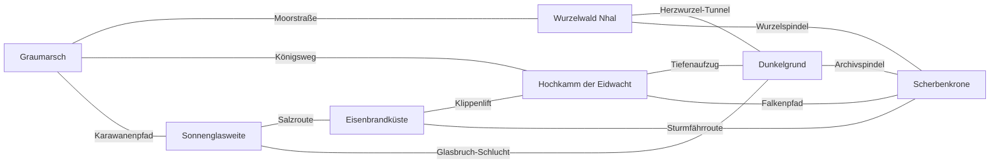
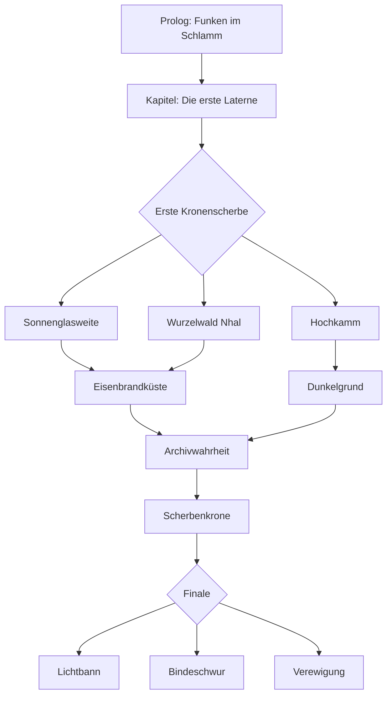

# Scherbenhimmel

## Executive Summary

**Scherbenhimmel** ist als groß angelegtes Open-World-Action-RPG mit optionalem Koop, starker Figurenbindung und live-service-fähiger Weltstruktur konzipiert. Der Kern des Spiels ist eine düstere, aber nicht hoffnungslose Fantasy-Welt, in der **Erinnerung physisch geworden ist**: als Ressource, als Magie, als Wunde und als politische Waffe. Die Konzeption umfasst eine vollständige Hauptgeschichte, sieben klar differenzierte Regionen, zwölf spielbare Figuren mit eigenen Handlungsbögen, regionale Fraktionen, Questketten für Haupt- und Nebeninhalte, dynamische Weltereignisse, saisonale Events, Housing, Mounts, Reputation, Crafting, kooperative Aktivitäten und eine Belohnungsökonomie, die Langzeitmotivation erzeugt, ohne unfair zu monetarisieren.

Die tragenden Designentscheidungen folgen gut dokumentierten Mustern erfolgreicher Genrevertreter: **The Witcher 3** steht für moralisch komplexe Welt- und Questgestaltung, **Guild Wars 2** für dynamische Events und kooperative offene Welt, **The Elder Scrolls Online** für Companions, Housing und Handwerk, **Diablo IV** für die Verzahnung aus Saisonquest, Journey und Battle Pass, und **Final Fantasy XIV** für niedrigschwellige, zeitlich klare, wiederkehrende Events mit einem etwas respektvolleren Umgang mit FOMO. Diese Referenzen sind auf offiziellen oder etablierten deutschsprachigen Seiten gut belegt und bilden die analytische Grundlage für die folgende Originalkonzeption. citeturn15view6turn15view7turn15view8turn9search0turn14view0turn17view0turn15view1turn15view2turn15view3turn15view4turn15view5turn19view0turn19view3turn7search0turn7search7

Mangels genauer Plattformvorgaben wird als Hauptannahme **PC/Konsole zuerst** gesetzt. Das bereitgestellte GitHub-Repository wurde zuerst geprüft; es ist jedoch **kein bestehender RPG-Lore-Brief**, sondern beschreibt vor allem einen browser-first Web-Prototypen auf TypeScript/Vite/Three.js und ein inhaltlich anderes Spielkonzept. Es dient daher hier als Produktionssignal für modulare Systeme und Scope-Disziplin, nicht als Kanon für Setting oder Quests. fileciteturn7file0 fileciteturn7file1 fileciteturn7file2

## Quellenlage und Designprinzipien

Für die Narrative gilt ein harter Grundsatz: **Nebenquests dürfen nie wie Füllmaterial wirken**. Die offizielle Witcher-3-Seite betont eine moralisch komplexe Welt mit Entscheidungen und Konsequenzen für Verbündete, Feinde und die Welt selbst; GameStar beschreibt das Spiel im Test als Sammlung „großartiger Geschichten“, „denkwürdiger Momente“ und schwerer Entscheidungen und nennt The Witcher 3 an anderer Stelle ausdrücklich ein Paradebeispiel für gute Nebenquests; bei den Game Awards 2015 gewann das Spiel zudem **Game of the Year** und **Best Role Playing Game**. Für **Scherbenhimmel** folgt daraus: Jede Nebenquest muss mindestens eine von vier Funktionen erfüllen – Weltgeschichte vertiefen, eine Figur verändern, einen Ort sichtbar verändern oder eine mechanische Fantasie freischalten. citeturn15view6turn15view7turn15view8turn9search0

Für die offene Welt gilt: **Die Karte muss reagieren, nicht nur existieren**. Guild Wars 2 beschreibt offiziell dynamische Events statt traditioneller Quest-Hubs, kooperative Teilnahme ohne Beutekonkurrenz und Schwierigkeit, die auf größere Gruppen reagiert; dieselben offiziellen Seiten zeigen außerdem Reittiere als Traversal-Werkzeuge statt bloße Geschwindigkeitsbeschleuniger und halten fest, dass kosmetische Mount-Skins keine Stärke oder Fähigkeiten verändern. Für **Scherbenhimmel** wird das übernommen als Regelwerk: Öffentliche Events dürfen scheitern oder gelingen, Gruppenspiel darf nicht mit Loot-Frust bestraft werden, und Mounts müssen topografische Probleme lösen. citeturn14view0turn17view0turn15view1

Für langfristige Bindung jenseits von Kampf und Loot sind **Gefährten, Housing und Handwerk** zentrale Säulen. ESO koppelt in den offiziellen deutschen Beschreibungen Gefährten an Beziehung, Ausrüstung und Questfreischaltung, vergibt in Homestead das erste Heim als Questbelohnung, erlaubt soziale Hausbesuche und macht Einrichtung zugleich zu Handwerk und Handelsgut; die offiziellen Guides listen darüber hinaus ein breites Handwerkssystem. Für diese Konzeption bedeutet das: Die „Wohnstätte“ des Spielers ist keine Dekorationsnische, sondern ein Raum für Fortschritt, Story, soziale Präsenz, Sammelleidenschaft und ökonomische Aktivität. citeturn15view2turn15view3turn15view4turn15view5

Für Saisons und Events werden zwei Muster kombiniert. Diablo IV verzahnt saisonale Questreihe, neue Kräfte, Saisonreise und Battle Pass; dabei liegen spielrelevante Vorteile wie saisonale Blessings auf kostenlosen Stufen, während Premium-Stufen vor allem Kosmetika, Reittiere und Platin liefern. FFXIVs saisonale Events sind zugleich niedrigschwellig, zeitlich glasklar, oft schon ab **Stufe 15** zugänglich und führen ältere Eventgegenstände später wieder über Händler zurück. Für **Scherbenhimmel** heißt das: **Saisonmechanik immer frei, Premium immer kosmetisch, Eventbelohnungen kehren kontrolliert zurück**. citeturn19view0turn19view1turn19view3turn19view4turn7search0turn7search7

Schließlich zeigen Diablo IVs globale Event-Meilensteine und Rückkehrer-Boni sowie FFXIVs Community-Ereignis- und Anmeldelogik, dass sozial organisierte Inhalte wesentlich zur Bindung beitragen können. Für das vorliegende Design wird daraus ein **soziales Weltgedächtnis** abgeleitet: Anschlagtafeln, Event-Kalender, regionale Community-Ziele, seriöse Catch-up-Schienen und explizite Wiedereinstiegsfenster. citeturn15view9turn15view10turn7search6

## Weltentwurf und Regionen

**Arbeitstitel des Spiels:** **Scherbenhimmel**  
**Weltname:** **Veyra**  
**Großes Nostrum der Lore:** **Der Scherbenfall**  
**Zentrale Ressource:** **Mondglas**  
**Zentrale Bedrohung:** **Die Nachtflut**  
**Spielerfaktion:** **Die Letzten Laternen**  
**Antagonistische Macht:** **Das Leere Archiv**, geführt von **Sereth, der Archivkönigin**

Vor fast fünf Jahrhunderten zerbarst Veyras zweiter Mond **Mareth**. Die Splitter regneten als Mondglas auf die Welt hinab. Dieses Glas konserviert nicht nur Licht, sondern **Erinnerung, Stimmung, Schuld und Möglichkeit**. Wo besonders viel Mondglas vergraben liegt, erinnern sich Orte an Dinge, die längst vergangen sein sollten: Städte flüstern die Namen ihrer Toten, Wälder speichern vergessene Schwüre, Küsten ziehen Wracks aus anderen Jahren an, und ganze Schlachtfelder können sich bei Nacht erneut „abspielen“. Über den Kontinent wurden daraufhin Laternenorden gegründet, die mit Leuchtfeuern die Erinnerung beruhigen sollten. Doch nun versagen diese Lichter. Die Nachtflut steigt wieder.

Die Welt ist als **sieben große Makroregionen** angelegt: jede mit eigener Kultur, Wirtschaft, Gegnerökologie, Flora, Tierwelt, Musikfarbe, Questtonalität und Alltagsritualik. Das Ziel ist nicht nur Abwechslung, sondern **identifizierbare regional-narrative Identität**.



| Region | Biome | Kultur und Ökonomie | Schlüsselorte | Bedrohungen | Ambient-Aktivitäten |
|---|---|---|---|---|---|
| **Graumarsch** | Moor, Ackerland, Kriegstruinen | Grenzbauern, Torfstecher, Laternenhüter; Getreide, Torf, Sumpföl | Fackelruh, Wehrmühle Halwyr, Sumpfkathedrale | Nachtflut-Soldaten, Dammräuber, Wassergeister | Laternenflicken, Aalräuchern, Wachenaushebungen |
| **Sonnenglasweite** | Glaswüste, Salzbecken, Canyons | Karawanenhäuser, Relikthändler, Glasmacher; Salz, Spiegelglas, Verträge | Azhar, Spiegelmarkt, Untertempel Kesir | Scherbenstürme, Sandwandler, Schuldkollektoren | Sandsegel-Rennen, Nachtauktionen, Brunnenpredigten |
| **Wurzelwald Nhal** | Waldsumpf, Pilzhochforste, Flußarme | Wurzelchor, Kräuterfrauen, Harzsammler; Alchemie, Färbemittel, lebendes Holz | Silberraunen, Herzbaum, Tränenbecken | Namenfraß, Harzbestien, Moorkultisten | Kräutersammeln, Totenlieder, Pilzmarkt |
| **Eisenbrandküste** | Klippen, Werften, Schiffsfriedhof | Werftzünfte, Freibeuter, Arbeitergilden; Fischfang, Schiffsbau, Bergung | Sturmhafen, Aschdock, Glockenriff | Leviathane, Tiefenglocke, Sturmsekten | Dockstreiks, Seemannslieder, Schiffsversteigerungen |
| **Hochkamm der Eidwacht** | Hochalpen, Klöster, Pässe | Adelshäuser, Falkner, Mönchsorden; Silber, Transit, Handschriften | Falkenwacht, Kloster Eldran, Weißzahnpass | Eidbrecher, Schneerevenants, Hauskrieg | Falkenpflege, Schwertübungen, Passmessen |
| **Dunkelgrund** | Höhlen, Minenschächte, Lavarisse | Exilkolonien, Schmuggler, Erzbrüder; Erz, Pilzalchemie, Reliktverhüttung | Rußmarkt, Schacht Null, Maschinensaum | Echohülsen, Tunnelwyrme, Maschinenheilige | Schachtfeste, Pilzbrauen, Illegale Arenen |
| **Scherbenkrone** | Himmelskrater, schwebende Ruinen | Endgame-Zone; keine stabile Alltagsökonomie, sondern Archiv-Fragmente | Lumenkessel, Asterhof, Archivspindel | Archivleiber, Zeitnarben, Glasengel | Rissjagden, Endgame-Metas, Reliktkonvergenzen |

**Graumarsch** ist die Startregion und soll den Ton des Spiels setzen: bewohnt, arbeitsam, verwundet. Keine Touristen-Fantasy, sondern ein nasses Grenzland, in dem Pfahlbauten unter Windlampen stehen und Kinder tote Glühkäfer sammeln, um Nachtlaternen zu flicken. Die Region lebt von Getreide, Torf und Sumpföl; ihre Flora besteht aus Lampenorchideen, schwarzem Schilf und Moorapfelbäumen, die Fauna aus Sumpfhirschen, Spiegelaalen und miasmatischen Insektenwolken. Haupt-NPCs sind **Ellin Fracht**, Dorfherrin von Fackelruh, **Jorik Dammwächter**, letzter Veteran des alten Laternenordens, und **Mara Esch**, Schifferin und frühe Questgeberin für soziale Rettungsmissionen. Die Kernfantasie ist: *kleine Menschen gegen eine zu große Erinnerung*.

**Sonnenglasweite** bringt Weite, Tempo und ökonomische Politik. Hier bestimmt nicht militärische Macht allein, sondern **Schuld, Vertrag und Ruf**. Tagsüber brennt die Wüste, nachts spiegeln sich alte Sternbilder im Glasboden. Die Region ist Heimat der Karawanenhäuser, die nicht nur Waren, sondern auch Geschichten handeln. Ökonomisch dominant sind Salz, Spiegelglas, Reliktgrabung und Versicherungsversprechen. Haupt-NPCs sind **Matriarchin Samira Zahir**, **der Schuldbuchhalter Noret**, und **Mina vom Spiegelmarkt**, eine jugendliche Fälscherin, die nahezu jede Region verbindend infiltriert. Die Fantasie ist: *schöne Weite mit messerscharfer Zivilisation*.

**Wurzelwald Nhal** ist warm, organisch und unheimlich. Der Wald singt im Wortsinn; Totenlieder hängen in Wurzeln fest, Namen können hier verloren gehen wie Blut. Die Region lebt von Alchemie, Harz, Färbemitteln und seltenen Kräutern. Haupt-NPCs sind **Mutter Lehn**, Sprecherin des Wurzelchors, **die stumme Harzsammlerin Vey**, und **Irrvater Tholm**, ein Gelehrter, der versucht, vergessene Namen als Ware zu handeln. Die centrale Bedrohung ist der **Namenfraß**, eine Mondglas-Krankheit, die Beziehungen zerstört, indem sie Identifikationen auslöscht. Das erzeugt starke dramatische Quests, weil Bedrohung hier sozial und nicht nur physisch ist.

**Eisenbrandküste** ist die Region des Klassenkonflikts. Werften, Kräne, Signalglocken, Brackwasser und ölverschmierte Schiffsgerippe dominieren das Bild. Die Wirtschaft stützt sich auf Schiffsbau, Küstenhandel, Walfangrelikte, Kohle und Wrackbergung. Haupt-NPCs sind **Dockmeisterin Junna Kest**, **Kapitän Brann Terv**, und **Hochtöner Malrec** von der Tiefenglocke. Dort, wo andere Fantasy-Spiele Piratenromantik suchen, setzt **Scherbenhimmel** auf Hafenarbeit, Streik, Kult und Wettergewalt. Die Ambient-Ebene ist laut, mechanisch und sozial dicht.

**Hochkamm der Eidwacht** ist die eleganteste und grausamste Region. Unter Schnee, Falkenwappen und Klosterschweigen verbergen sich alte Machtverträge. Häuser herrschen über Pässe und Blutlinien, Mönchsordnungen verwalten Gedächtnisarchive, und jeder Eid hat buchstäblich Gewicht. Ökonomie: Silber, Transit, Wolle, Falkenzucht, Skriptorien. Haupt-NPCs sind **Äbtissin Orsane**, **Lord Vael Falkenlicht**, und **Schreiberkind Eno**, das heimlich die Eidbücher fälscht. Die Region trägt den politischen Teil der Hauptgeschichte.

**Dunkelgrund** ist kein bloßer unterirdischer Dungeon-Komplex, sondern eine komplette Gegenwelt: Kohlenschächte, Erzadern, Pilzviertel, improvisierte Märkte, Schmugglergleise und Maschinenruinen. Es ist die materialistischste Region des Spiels. Hier werden Relikte umgeschmolzen, Schulden versteckt und neue Namen angenommen. Haupt-NPCs sind **Bor Ren**, Erzsprecher des Rußmarkts, **Assa Drei-Lichter**, Schmugglerin und mögliche Wohnungsmeisterin fürs Housing-System, sowie **Sankt Ival**, ein defekter Maschinenheiliger. Dunkelgrund ist zugleich Crafting-Hub, Schmugglernetz und moralisch graue Zone.

**Scherbenkrone** ist die spätspielige Konvergenzzone. Wege verändern sich mit Metas, Gravitation arbeitet unzuverlässig, und Archivechos sprechen mit bekannten Stimmen. Dieser Raum soll das Gefühl von finaler Wahrheit tragen: ehrfurchtgebietend, schön, verzerrt. Die Region existiert nicht, um einfach schwerer zu sein, sondern um die große thematische Frage elegant zuzuspitzen: *Ist eine Welt ohne Vergessen überhaupt noch lebendig?*

## Hauptgeschichte, Figuren und Fraktionen

Die Hauptgeschichte ist in **drei Akte** angelegt.

**Akt eins** beginnt lokal: In Fackelruh versagt eine Laterne, die Nachtflut überrennt das Moor, und die Überlebenden werden von den **Letzten Laternen** eingesammelt – einem fast erloschenen Bund aus Hütern, Archivkundigen, Fährtensuchern und Eidbrechern. Der Spielkern der ersten Stunden ist persönlich: Rettung, Flucht, Trauer, erste Verbündete. Gleichzeitig wird die Makrofrage gesetzt, als weitere Regionen ähnliche Störungen melden.

**Akt zwei** öffnet die Welt. Der Spieler stabilisiert Regionen, rekrutiert Figuren, entzündet Leuchtfeuer und sammelt **Kronenscherben**, die angeblich zur Heilung der Welt dienen. Die große Wendung lautet jedoch: Die Laternen unterdrücken nicht nur die Nachtflut, sie **komprimieren Erinnerungen** – und waren historisch Teil eines Systems, das nach dem Scherbenfall bestimmte Wahrheiten tilgen sollte. Das Kaiserreich Ordis verursachte den Scherbenfall nicht zufällig, sondern im Versuch, eine Rebellion aus der Geschichte zu reißen.

**Akt drei** zieht diese Erkenntnis ins Ideologische. **Sereth**, die Archivkönigin, erscheint nicht als reine Dämonin, sondern als letzte Hüterin eines grausam logischen Systems: Wenn Menschen immer wieder dieselben Fehler begehen, ist vielleicht nicht Macht das Problem, sondern das Vergessen. Ihr Ziel ist die Wiedervereinigung aller zersplitterten Erinnerung in einem einzigen, unverlierbaren Archiv. Das würde Kriege nicht mehr „vergessen“ lassen – aber auch Wandel, Irrtum, Vergebung und freies Werden zerstören. Das Finale dreht sich daher nicht um „böse Macht abschalten“, sondern um die Frage, **wie viel Schmerz eine Welt erinnern muss, um nicht wieder in ihn zurückzufallen**.

| Figur | Kampffantasie | Hintergrundgeschichte | Motivation | Zentrale Beziehungen | Persönlicher Bogen |
|---|---|---|---|---|---|
| **Lyra Dorn** | schnelle Klingen + Pistole, Jägerin | Überlebende aus Fackelruh, Tochter eines verschwundenen Laternenhüters | Wahrheit über den Untergang ihres Dorfs | Mira, Oren, Velka | von Rachsucht zu Verantwortung |
| **Mira Voss** | Runenklingen, Sigil-Combo, Kontrolle | ehemalige Archivgelehrte, Exilantin | Ordis’ Geschichtslüge offenlegen | Lyra, Sereth, Neris | von Zynismus zu Einsatz |
| **Tarek al-Sahir** | Speer, Täuschung, Mobilität | Karawanensohn aus Azhar, früher Schmuggler | eine alte Schuld auslöschen | Brannok, Mina | von Flucht zu Bindung |
| **Siofra Nhal** | Bogen, Harzfallen, Naturresonanz | Sprecherkind des Wurzelchors | den Namenfraß stoppen | Neris, Oren | von sakraler Distanz zu Liebe |
| **Brannok Reef** | Harpune, Ankerklinge, Konterspiel | Ex-Freibeuter, verlor seinen Bruder an einen Küstenkult | Bruder retten oder richten | Tarek, Yara | von Wut zu Loyalität |
| **Edda Falkenlicht** | Großschwert, Bannstandarten, Schutz | entehrte Adlige aus Hochkamm | ihr Haus stürzen, ohne die Region zu vernichten | Oren, Lyra | von Pflicht zu echter Gerechtigkeit |
| **Oren Vale** | Kettenstab, Heilung, Wards | Mönch des Klosters Eldran | Frieden bewahren, ohne feige zu werden | Edda, Siofra | von Pazifismus zu aktiver Barmherzigkeit |
| **Yara Kest** | Hammer, Aufladungen, Drohnenkern | Ingenieurin und Dockarbeiterkind | Küstenstädte vom Kult lösen | Brannok, Kael | von Pragmatismus zu Vision |
| **Kael Nhar** | Dolche, Schatten, Debuffs | entflohener Schachtgefangener | verkaufte Mitgefangene wiederfinden | Yara, Mira | von Selbstschutz zu Opferbereitschaft |
| **Neris Vael** | Sichel, Echozauber, Opfermagie | scherbengemarktes Medium | herausfinden, wessen Erinnerungen sie trägt | Siofra, Mira, Sereth | von Identitätsangst zu Selbstbestimmung |
| **Velka Sturmtritt** | Lanze, Mountmanöver, Verfolgung | Grenzreiterin und Fährtensucherin | verschwundene Geliebte aus einer Sturmzone bergen | Lyra, Brannok | von professioneller Härte zu Zugehörigkeit |
| **Cyr Ohne Gestern** | Formwechsel-Waffe, Resonanzstile | künstlich entstandenes Archivwesen | eine eigene Identität erzwingen | Sereth, Neris, die ganze Gruppe | von Werkzeug zu Person |

Die **spielbaren Figuren** sind keine rein mechanischen Archetypen, sondern narrative Träger. Jede Figur besitzt drei Progressionspfade: einen **Kampfpfad**, einen **Herkunftspfad** und einen **Bindungspfad**. Der Kampfpfad verändert Kombo- und Rollenfantasie; der Herkunftspfad knüpft an regionales Kulturerbe, Fraktionsbeziehungen und Weltwissen; der Bindungspfad schaltet Duoskills, Lagerfeuerszenen, alternative Questlösungen und teils sogar andere Enddialoge frei.

Die **wichtigsten Nebenhandlungen** verweben sich direkt mit der Hauptgeschichte. Lyras Vater könnte Teil einer historischen Vertuschung gewesen sein. Miras frühere Forschung kann zwei Regionen retten, aber eine Figur isolieren. Brannoks Bruder ist nicht einfach entführt, sondern freiwillig Kultist geworden. Edda hat gute Gründe, ihr Haus zu stürzen – aber ihr Haus hält auch Bergpässe offen. Neris ist mehr als Medium; sie trägt möglicherweise Erinnerungsreste jener Frau, die Sereth einst scheiterte. Diese Bögen sorgen dafür, dass Hauptstory und Companion-Story **nicht nebeneinander**, sondern **ineinander** laufen.

**Dialogbeispiel aus der Hauptquest „Die Stimme im Glas“**

```text
Szene: Zerbrochener Archivsaal in der Scherbenkrone. Mondglas flimmert in den Wänden.

Sereth:
Ihr nennt das Leben frei, weil es vergessen darf.
Ich nenne es grausam, weil es immer wieder dieselben Kinder opfert.

Lyra:
Vergessen ist nicht immer Feigheit.
Manchmal ist es die einzige Art, weiterzuatmen.

Mira:
Nein. Weiteratmen ist, die Wahrheit anzusehen und trotzdem nicht zu knien.

Sereth:
Dann hebt eure Schwerter.
Aber wisst: Wenn ihr mich tötet, rettet ihr nicht die Wahrheit.
Ihr verteilt sie nur wieder in Scherben.
```

## Questarchitektur, Events und Belohnungen

Für den **Large Scope** sollte **Scherbenhimmel** inhaltlich mit einer echten Lebensfülle geplant werden. Ein belastbarer Zielrahmen wäre:

- **8 Hauptkapitel** mit rund **38 Story-Missionen**
- **24 regionale Questketten**
- **12 Charakterketten** mit je 4 bis 6 Stufen
- **4 Fraktionslinien** mit je 5 bis 7 Missionen
- **6 Wiederholschleifen** für Endgame und tägliches Spiel
- **mindestens 60 dynamische Weltereignis-Templates**
- **4 jährliche Festivals**
- **4 quartalsweise Saisons** mit je 1 Story-Mini-Arc, 1 Meta-Event und 1 Reward-Track

Das wichtigste Strukturprinzip lautet: **Jede Questkette hat einen sozialen, räumlichen und systemischen Nachhall**. Nach einer guten Kette soll idealerweise ein Ort anders aussehen, eine Figur sich anders verhalten, eine Fraktion anders sprechen oder der Spieler sich mechanisch anders ausdrücken können.



| Questkette | Typ | Trigger | Dramatische Funktion | Hauptbelohnungen | Balancing-Hinweis |
|---|---|---|---|---|---|
| **Funken im Schlamm** | Hauptquest | Spielstart | emotionale Verwurzelung, erstes Trauma | Lyra freischalten, Camp-System | Solo-freundlich, geringe Mechaniklast |
| **Die erste Laterne** | Hauptquest | Prolog abgeschlossen | erklärt Welt, Fraktion, erste Entscheidung | Hub-Basis, Weltkarte, Fraktionsruf | frühe Bossphase mit Assist-NPCs |
| **Der Preis des Salzes** | Regional | Sonnenglasweite betreten | zeigt Schuldökonomie der Wüste | Tarek, Handelsroute, Sandsegel | 70 % Erkundung, 30 % Kampf |
| **Ein Garten, der Namen frisst** | Regional | Wurzelwald bei Nacht | emotionale Identitätsbedrohung | Siofra, Harzrezepte, Namenssiegel | dialoglastig, moralische Wahl |
| **Die Glocke unter der Brandung** | Regional/Faktion | Eisenbrandküste Rufstufe 2 | Kult- und Klassenkonflikt | Küstenmeta, Brannok-Bindung | 1–4 Spieler, skalierte Wellen |
| **Falken ohne Himmel** | Regional | Hochkamm Kapitelmitte | politisches Intrigenspiel | Edda, Hausbund-System | mehrere nicht-kämpferische Lösungen |
| **Schacht Null** | Regional | Dunkelgrund Zugang | Crafting- und Relikt-Loop öffnen | Reliktprägung, Kael | labyrinthisch, kurze Rücksetzpunkte |
| **Kein Grab für Sturmreiter** | Companion | Velka Bindung 2 | Liebes- und Verlustmotiv | Mount-Manöver, Kosmetik | kurze Jagdmission, hoher Fokus |
| **Aufträge der Letzten Laternen** | Wiederholbar | Hub freigeschaltet | daily/weekly Struktur | Ruf, Materialien, Housing-Blaupausen | variable Objectives, 12–18 Min. |
| **Fest der Ersten Funken** | Jahres-Event | Frühlingsfenster | entspannte Gemeinschaftsstimmung | Emotes, Lampenskins, Hausdeko | niedrigschwelliger Zugang |

**Beispiel einer ausgearbeiteten Hauptquest: „Die Glocke unter der Brandung“**

**Trigger:** Eisenbrandküste erreicht, Ruf bei Werftzünften auf Stufe 2, mindestens drei Hauptfiguren rekrutiert.  
**Szenerie:** Sturmabend, gesperrte Docks, verschwundene Schiffsbesatzung, Glockensignal aus dem Nebel.  
**Ziele:**  
Erstens die Quelle der Glockenschläge lokalisieren.  
Zweitens Dockarbeiter retten oder den Munitionsspeicher sichern.  
Drittens einen Kultprediger verfolgen oder den einstürzenden Anleger stützen.  
Viertens den ersten Leviathan-Ableger zurücktreiben.  
**World-State-Folge:** Wenn zu viele Arbeiter sterben, bleibt ein Werftviertel im Zustand „Trauerdock“; wenn gerettet wird, eröffnet dort später ein Handwerksbezirk.  
**Rewards:** Küstenzugang, Brannok-Bindung, Werftzunft-Ruf, Leviathan-Knochen für seltene Waffenmods, neue Housing-Kulisse „Salzsteg“.  
**Balance:** 20 bis 30 Minuten, funktioniert solo mit KI-Gefährten oder im Koop; Feindwellen skalieren nicht linear, sondern über zusätzliche Rollenmechaniken, damit Mehrspieler nicht zu reinen HP-Schwämmen führen.

**Beispiel einer ausgearbeiteten Nebenquest: „Ein Garten, der Namen frisst“**

**Trigger:** Im Wurzelwald hört der Spieler drei verschiedene NPCs denselben Satz über ein „namenloses Kind“ sagen.  
**Ziele:**  
Ein verschwundenes Mädchen suchen.  
Mit drei Dorfbewohnern sprechen, von denen keiner sich an dieselbe Person erinnert.  
Im Wurzelgarten Mondglas-Schösslinge vernichten oder umleiten.  
Entscheiden, ob die verlorenen Namen verbrannt, im Chor besungen oder in einer Reliquie konserviert werden.  
**Rewards:** Siofra-Bindung, Rezept „Harzsalbe gegen Verfall“, persönlicher Gartenplot fürs Housing, alternativer Dialog mit Neris im mittleren Spiel.  
**Balance:** sehr wenig Pflichtkampf, hoher emotionaler Payoff, ideale Quest für Spieler, die dialogisch eintauchen wollen.

**Beispiel einer wiederholbaren Quest: „Konvoi durch die Glassenke“**

**Trigger:** Karawanenhaus-Zugang in Sonnenglasweite.  
**Ziele:**  
Route wählen.  
Karawane durch Sandsturm, Räuber oder Vertragserpressung bringen.  
Optional Fracht retten, Schuldschein verbrennen oder extralegale Ware schmuggeln.  
**Rewards:** Handelsgutscheine, Tarek-Ruf, Farbstoffe, seltene Wüstendeko, Chance auf Mount-Zubehör.  
**Balance:** 12 bis 15 Minuten, rotiert täglich, gibt Teilbelohnung auch bei beschädigter Karawane – kein Alles-oder-Nichts-Frust.

**Dialogskript aus der Nebenquest „Ein Garten, der Namen frisst“**

```text
Siofra:
Sag mir ihren Namen.

Dorfbewohnerin:
Ich ... ich weiß, dass ich sie geliebt habe.
Aber ihr Name ist wie Wasser in geschlossener Hand.

Spieleroption A:
Dann geben wir ihn ihr zurück.

Spieleroption B:
Dann lassen wir sie endlich ruhen.

Neris:
Vorsicht. Manche Namen wollen nicht zurück.
Manche kehren hungrig zurück.
```

Die **dynamischen Weltereignisse** bilden den Pulsschlag der offenen Welt. Jede Region besitzt mindestens einen großen Meta-Zyklus und mehrere kleine Rotationsereignisse.

| Weltzustand | Beschreibung | Typische Folgen | Spielerwirkung |
|---|---|---|---|
| **Ruhig** | Region stabilisiert | Händler offen, geringe Bedrohung | Fokus auf Story, Sammeln, Wohnen |
| **Unruhig** | Vorspann vor Eskalation | neue Gerüchte, Elite-Spawns, Sperrungen | spontane Kämpfe, Bonusressourcen |
| **Nachtflut** | aktive regionale Eskalation | Weltbosse, veränderte Wege, visuelle Mutation | öffentliches Koop, hohe Beute |
| **Nachhall** | Zustand nach Sieg/Niederlage | beschädigte oder erholte Orte | sichtbare Konsequenzen, neue Quests |

Jede Region bekommt eine eigene Meta-Signatur:

- **Graumarsch:** *Der Damm bricht*  
- **Sonnenglasweite:** *Sturm über dem Spiegelmarkt*  
- **Wurzelwald:** *Der Namenfraß erwacht*  
- **Eisenbrandküste:** *Die Glocke ruft*  
- **Hochkamm:** *Fall der Falkenlinie*  
- **Dunkelgrund:** *Schacht Null kollabiert*  
- **Scherbenkrone:** *Der Himmel blutet Glas*

Die **Jahres- und Limited Events** sind nicht bloß Shop-Anlässe, sondern Tonalitätsventile:

| Event | Zeitraum | Fantasie | Kernaktivitäten | Belohnungsprofil |
|---|---|---|---|---|
| **Fest der Ersten Funken** | Frühling | Hoffnung, Lichter, Gemeinschaft | Lampenumzüge, Miniquests, Musik | Emotes, Lampenskins, Wohndeko |
| **Wettfahrt der Glasrochen** | Sommer | Wagnis, Geschwindigkeit, Hitze | Mount-Rennen, Zeitprüfungen | Mount-Farben, Banner, Titel |
| **Jagd der stillen See** | Herbst | dunkle Küstenmythik | Koop-Jagden, Leviathan-Event | Waffenillusionen, Trophäen |
| **Langnachtmarkt** | Winter | Melancholie, Rückkehr, Handel | Geschenke, Rückblickquests, Sozialhub | frühere Eventitems, Musikrollen |

## Systeme, UI UX und Live Service

Die **Itemisierung** muss in einem Action-RPG gleichzeitig lesbar, begehrlich und build-relevant sein. Dafür erhält **Scherbenhimmel** sechs Ausrüstungsstufen:

| Tier | Bedeutung | Typische Quellen | Spielergefühl | Anti-Frust-Regel |
|---|---|---|---|---|
| **Gewöhnlich** | Basiswerte, Futter für Crafting | offene Welt, Händler | frühe Stabilität | schnelles Auto-Verwerten |
| **Veredelt** | erste Modifikatoren | Quests, Standard-Dungeons | kleine Fortschrittsfreude | garantiert in Story-Quests |
| **Selten** | Build-Entscheidungen beginnen | Elites, Eventkisten | „Jetzt baue ich etwas“ | Smart-Loot auf aktive Figur |
| **Signatur** | figurenspezifische Affixe | Companion-Quests, Fraktionslinien | Identität und Stil | fokussierbar über Zieljagd |
| **Relikt** | systemverändernde Effekte | Region-Metas, Bosse | Build-Sprung | Pity-System über Fragmente |
| **Mythisch** | Endgame-Langzeitziele | Scherbenkrone, Saisonboss | Prestige und Experiment | fragmentiertes Crafting statt reines RNG |

Die **Crafting-Berufe** sind auf fünf starke Fantasien reduziert: **Schmiedekunst**, **Runenbindung**, **Leder- und Tuchwerk**, **Alchemie**, **Wohnwerk**. Die Reduktion ist absichtlich: Zu viele Handwerkslinien erzeugen Verwaltungsfüllung. Wichtiger ist, dass jeder Beruf sichtbar in der Welt verankert bleibt. Dunkelgrund liefert Erz und Reliktschrott, Wurzelwald Alchemie, Eisenbrandküste Strukturteile, Sonnenglasweite Färbungen und Glas, Hochkamm seltene Schriften und Insignien.

Die **Währungen** werden sauber getrennt:  
**Marken aus Silber** für den normalen Wirtschaftskreislauf.  
**Laternenfunken** für offene Welt, Reparaturen und Hub-Upgrades.  
**Fraktionssiegel** für regionale Rufhändler.  
**Scherbenglimm** für High-End-Crafting.  
**Festmarken** für Jahres-Events.  
**Himmelssplitter** als Premiumwährung – ausschließlich für Kosmetik, Housing-Sets, Reittierskins, Lagerfeuer-Styles, Emotes, Musik und Komfortästhetik.

Die **Companion-Logik** ist nicht passiv. Jeder spielbare Held kann gleichzeitig **aktive Spielfigur** oder **begleiteter Gefährte** sein. Die Begleiter werden über eine kompakte Befehls-Rose gesteuert: **Drücken**, **Halten**, **Unterbrechen**, **Interagieren**, **Zurückziehen**. So bleiben sie im Action-RPG klar bedienbar, ohne das Spiel in Taktik-Kleinstdialoge zu zerlegen. Companion-Rapport verändert nicht nur Banter, sondern schaltet Duo-Fähigkeiten, alternative Questabschlüsse und sichere Wohnraum-Gäste frei.

Die **Mounts** sollen sich hervorragend anfühlen und jeweils ein Bewegungsproblem lösen, statt bloß Tempo zu erhöhen. Empfohlen werden vier Haupt-Mounts:

- **Risshirsch** für weite Sprünge und schnelle Landwege  
- **Moorläufer** für Sumpf, Flachwasser und zähe Böden  
- **Glasrochen** für Wüsten, Gleitpassagen und schmale Kanten  
- **Kettenbär** für Last, Mauerrisse und schwere Interaktionen  

Dieser Ansatz übernimmt die stärkste Lehre aus Guild Wars 2: Traversal wird zur Weltfantasie. Parallel werden kosmetische Mount-Skins strikt von Macht getrennt. citeturn17view0turn15view1

Das **Housing** wird als **Laternenhof** verankert, einer ausbaubaren Basis mit privatem Bereich, Werkstätten, Gartenplot, Trophäenraum und öffentlichen Besuchsoptionen. Zusätzlich existieren regionale Außenhäuser – Salzhäuser an der Küste, Klosterzellen im Hochkamm, Pilzwohnungen in Dunkelgrund. Wichtig ist die emotionale Grammatik: Housing darf nicht nur zeigen, was der Spieler **kauft**, sondern muss zeigen, **wo er war, wen er rettete, welche Fraktionen ihm vertrauen und welche Monster er überlebt hat**. Die Inspiration dafür stammt sichtbar aus ESOs Verbindung von Questzugang, Haus, Handel und sozialem Besuch. citeturn15view2turn15view3

Die **UI/UX** sollte drei Gefühle erzeugen: Klarheit im Kampf, Lust am Entdecken und Stolz auf Beziehungen. Dafür werden folgende Oberflächen empfohlen:

| UI-System | Zweck | Warum es sich gut anfühlt |
|---|---|---|
| **Fadenkarte** | visualisiert Questketten als Narrative Threads | zeigt Zusammenhänge statt bloßer Listen |
| **Echo-Lupe** | hebt Spuren, Stimmen, räumliche Geheimnisse hervor | Erkundung fühlt sich aktiv an |
| **Bannkreis-Rose** | Companion-Commands und Schnellaktionen | wenig Tasten, hohe Ausdruckskraft |
| **Regionenpuls** | zeigt Weltzustände und Meta-Eskalation | Spieler versteht, warum Orte sich ändern |
| **Lagerfeuer-Menü** | Teamverwaltung, Beziehungsdialoge, Crafting | Die Gruppe fühlt sich wie Familie an |
| **Wohnkatalog mit „Zuletzt verdient“** | schnelle Platzierung neuer Trophäen | Belohnungen leben außerhalb des Inventars |

Die **Multiplayer-Interaktionen** sollen kooperativ, leichtgewichtig und ungriefbar sein. Offene Welt für 1 bis 4 im engen Koop, öffentliche Metas für deutlich mehr Teilnehmende, individuelle Belohnungsverteilung, gemeinsames Tagging, keine Knoten-Konkurrenz bei Ressourcen. Das ist direkt anschlussfähig an die kooperative GW2-Lehre. Zusätzlich sollte es ein **Ereignisbrett** geben, auf dem Spieler Gruppen für Weltbosse, Wohnungsbesuche, Handelstreffen oder Fraktionsruns eintragen können – ein Motiv, das in FFXIVs organisierter Community-Ereignissuche bereits sichtbar ist. citeturn14view0turn7search6

Für den **Live-Service** wird ein **12-Wochen-Zyklus** empfohlen. Jede Saison enthält:

- einen kostenlosen Story-Mini-Arc von 4 bis 8 Stunden  
- eine freie Saisonmechanik  
- ein regionales Meta-Event oder eine Zonenmutation  
- einen Free Track mit Materialien, Ruf-Kürzern, Housing-Blaupausen, Farben, Musik und Komfortobjekten  
- einen Premium Track mit rein kosmetischen Varianten, Emotes, Lagerfeuer-Skins, Hausfassaden und Mount-Skins  

Die Fairness-Regel sollte explizit kommuniziert werden: **Power läuft nie durch Premium**. Das wird durch die Referenzen gestützt: Diablo IV legt spielrelevante Saisonvorteile auf kostenlose Stufen, während Premium vor allem Kosmetik und Währung enthält; FFXIV setzt auf niedrigschwellige, klar befristete Saisonereignisse und bringt ältere Eventbelohnungen später zurück; GW2 trennt kosmetische Mount-Ausdrücke von Reitstärke. Genau diese Mischung ist für ein „monetization-friendly but player-respecting“-Modell am überzeugendsten. citeturn19view0turn19view1turn19view3turn19view4turn7search0turn7search7turn15view1

## Onboarding, Pacing und Umfang

Ein großer Open-World-ARPG-Entwurf scheitert oft nicht an zu wenig Inhalt, sondern an **falscher Reihenfolge von Inhalt**. Deshalb ist das Onboarding von **Scherbenhimmel** streng getaktet.

| Spielzeit | Ziel | Spielererlebnis |
|---|---|---|
| **0–30 Minuten** | emotionaler Haken | Dorfverlust, Flucht, erste Nachtflut |
| **30–90 Minuten** | Systembasis | Kampf, Lagerfeuer, erstes Vertrauensgespräch |
| **1,5–3 Stunden** | Weltoffenheit | erster Hub, erste side-story, öffentliche Events sichtbar |
| **3–5 Stunden** | Figurenvielfalt | zweite und dritte spielbare Figur |
| **5–7 Stunden** | Bewegungsfantasie | erster Mount, erste echte Weiträumigkeit |
| **7–10 Stunden** | Besitzgefühl | erstes Housing-Zimmer, erste Werkbank |
| **10–15 Stunden** | politische Tiefe | erste Fraktionsentscheidung mit lokalem Nachhall |
| **15–25 Stunden** | Midgame-Identität | Build-Spezialisierung, erste Signaturausrüstung |
| **25–40 Stunden** | regionale Meisterschaft | erste komplette Region verändert sich sichtbar |
| **40+ Stunden** | Endgame-Aufbau | Scherbenkrone, Metas, Reliktjagd, Saisonfähigkeit |

Der **neue Spieler** sollte früh erleben, dass dieses Spiel nicht von Grind lebt, sondern von **Konsequenz, Zuhause und Beziehung**. Darum sind drei Dinge früh freizuschalten: ein **Companion**, ein **Mount**, ein **persönlicher Raum**. ESOs Quest-Housing-Idee und FFXIVs niedrige Event-Zugänglichkeit stützen genau diese Philosophie: Ein Spiel bindet besser, wenn die ersten großen Systeme nicht elitär, sondern einladend sind. citeturn15view2turn7search0turn7search7

Für die Produktionsrealität empfiehlt sich trotzdem eine saubere Staffelung des Umfangs.

| Scope | Regionen | Spielbare Figuren | Questumfang | Live-Service | Trade-off |
|---|---|---|---|---|---|
| **Small** | 3 + Endzone | 6 | 50–70 Stunden | 2 Feste/Jahr | höchste Machbarkeit, geringere Fraktionsdichte |
| **Medium** | 5 + Endzone | 9 | 80–120 Stunden | 4 Feste + 2 Saisons/Jahr | bestes Verhältnis aus Größe und Produktionsrisiko |
| **Large** | 7 voll | 12 | 140+ Stunden | 4 Feste + 4 Saisons/Jahr | maximale Lebensfülle, hohes Content- und QA-Risiko |

Wenn das Spiel tatsächlich in Richtung eines Web- oder Browser-Stacks gedacht sein sollte – was das bereitgestellte Repo technisch andeutet –, sollte **nicht** versucht werden, die Large-Version eins zu eins umzusetzen. In diesem Fall wäre eine **Medium-Version mit zonenweiser Ladearchitektur, neun Figuren und fünf Regionen** deutlich realistischer. Die große Lore-Bibel kann dennoch vollständig existieren und später erweitert werden; shipped werden dann zuerst die dichten, tragenden Systeme. fileciteturn7file0 fileciteturn7file2

Offene Punkte bleiben naturgemäß dort, wo keine Vorgaben vorliegen: konkrete Kunststilrichtung, Zielplattform-Härte, Kamera-Perspektive, technische Streaming-Grenzen, konkrete Business-Ziele und ob der Koop voll synchron oder eher locker-drop-in strukturiert sein soll. Diese Punkte ändern nicht die Tragfähigkeit der Lore- und Weltstruktur, beeinflussen aber Produktionsbudget, Animationslast und Questinszenierung deutlich.

In Summe ist **Scherbenhimmel** als **spielbares Weltenpaket** angelegt: nicht nur mit Story, sondern mit Routinen, Märkten, Trauer, Feier, Politik, Gebrauchtwerden, Besitz, Wiederkehr und Veränderung. Genau das füllt ein großes Open-World-Action-RPG mit Leben.